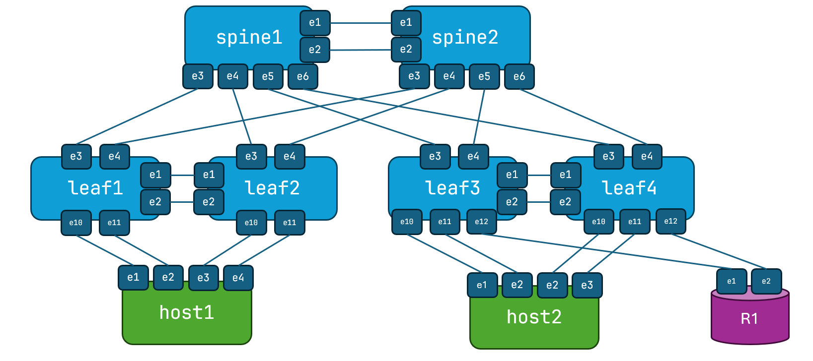

# NERD Project Containerlab Topologies

This is a repo of containerlab topologies for labbing. Currently these labs operate with cEOS-lab, which is Arista's containerized version of their EOS network operating system (NOS). As it's a container, it doesn't have all the features of a physical system (like hardware queues), but most features are supported. cEOS-lab is free to use for lab purposes, and is easy to obtain, which is why it's used for these topologies. 

## Medium Topology

This topolgy is two spines, four leafs, two 'hosts' and one router connected to two of the leafs. This is total of nine containers, and is tested for 16 GB VMs. I may do an even smaller topology for 8 GB. 

This topology is sufficient to run a three-stage Clos EVPN/VXLAN network, or a standard Layer 2 collapsed core (Arista calls is Layer 2 leaf/spine).

## Installing

In a directory clone this repo:

<pre>
git clone https://github.com/tonybourke/NERD_clab_topologies
</pre>

## Starting Topology

First, make sure you have Docker installed (this guide was based on the [Autobox](https://github.com/tonybourke/Project-NERD/tree/main/Autobox)). 

Change to the directory, like clos-medium, and run the containerlab deploy command. 

<pre>
sudo containerlab deploy