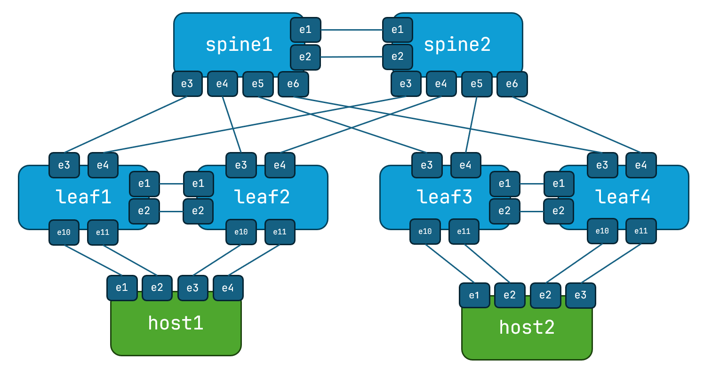

# NERD Project Containerlab Topologies

This is a repo of containerlab topologies for labbing. Currently these labs operate with cEOS-lab, which is Arista's containerized version of their EOS network operating system (NOS). As it's a container, it doesn't have all the features of a physical system (like hardware queues), but most features are supported. cEOS-lab is free to use for lab purposes, and is easy to obtain, which is why it's used for these topologies. 

## Small Topology

This topolgy is two spines, four leafs, and two 'hosts' (just cEOS devices pretending to be hosts, at some point I may replace them with Linux containers). This is total of eight containers, and is tested for 12 GB VMs. I may do an even smaller topology for 8 GB. 

To instantiate the sm